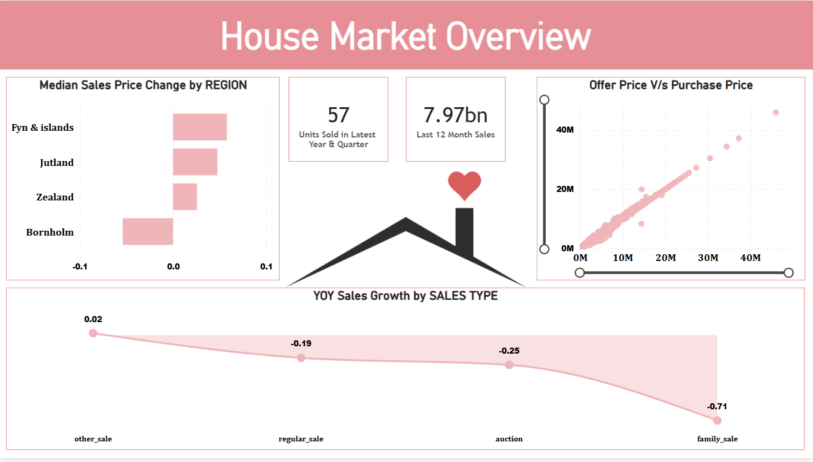
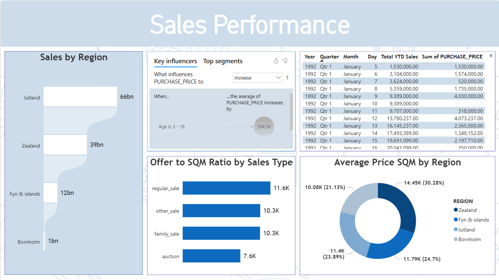
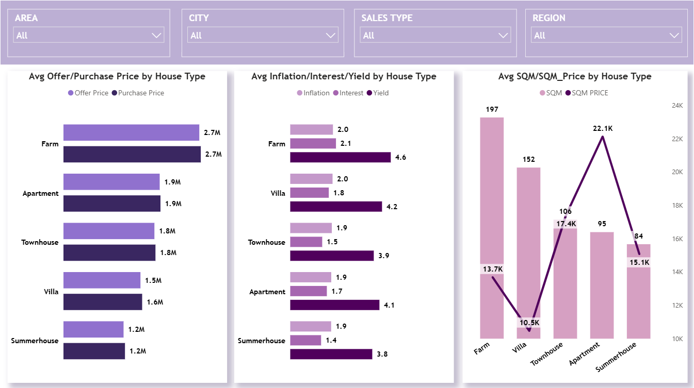

#  House Market Data Analysis

This project provides a complete data engineering and analytics pipeline for exploring the housing market. Using **AWS S3, IAM, Snowflake, and Power BI**, we ingest, clean, transform, and visualize real estate datasets to uncover valuable trends in sales, pricing, and regional performance.

📊 **Dashboard Link**: [View on Power BI](https://app.powerbi.com/groups/f9210e42-6a19-4005-b309-70a37a4451cf/reports/85ecf537-591f-4b3e-8867-fdc27f8cadd7/cf5c442d08c16a1277d5?experience=power-bi)

📂 **Dataset Link**: [Download Dataset](https://drive.google.com/file/d/1PpuWPloKOtTau5yG7QkXP2fuoDpQdXK4/view?usp=sharing)
---

## Problem Statement

The housing market is influenced by multiple dynamic factors such as regional demand, property type, sales channels, inflation, interest rates, and yield on mortgage bonds.
However, raw housing datasets are often unstructured, inconsistent, and incomplete — making it challenging to:

- Understand price trends across property types (e.g., farms vs apartments).
- Evaluate regional disparities in sqm prices and sales growth.
- Compare offer prices vs purchase prices to assess negotiation outcomes.
- Analyze the impact of economic indicators (inflation, interest rates, yield) on property performance.
- Provide actionable insights for investors, policymakers, and buyers.

This project addresses these challenges by building a data pipeline on Snowflake, integrating with Power BI, and developing interactive dashboards that provide clear visual insights into the housing market.
---

##  Project Workflow

1. **Data Storage and Access**

   * Created an **AWS S3 bucket** for centralized data storage.
   * Configured an **IAM Role** with appropriate access permissions.
   * Uploaded the original dataset into the S3 bucket.

2. **Snowflake Setup**

	Created a Snowflake database, schema, and table with structured fields:

```
CREATE DATABASE housing_data;
CREATE SCHEMA market_schema;

CREATE TABLE house_sales (
    id INT AUTOINCREMENT,
    city STRING,
    region STRING,
    sales_type STRING,
    house_type STRING,
    no_rooms INT,
    sqm FLOAT,
    purchase_price FLOAT,
    offer_price FLOAT,
    df_ann_infl_rate FLOAT,
    yield_on_mortgage_credit_bonds FLOAT
);
````

Created a stage pointing to the S3 bucket:

```
CREATE OR REPLACE STAGE housing_stage
URL = 's3://bucket-name/housing-data/'
STORAGE_INTEGRATION = aws_integration;
```

Copied the data into the Snowflake table:

```
COPY INTO house_sales
FROM @housing_stage
FILE_FORMAT = (TYPE = CSV FIELD_OPTIONALLY_ENCLOSED_BY='"' SKIP_HEADER=1);
```

### 3. Data Preparation

Created a working copy of the dataset to preserve raw data:

```
CREATE OR REPLACE TABLE house_sales_working AS
SELECT * FROM house_sales;
```

Ran exploratory SQL queries and updates:

**Average purchase price grouped by sales type:**

```
SELECT sales_type, AVG(purchase_price) AS avg_purchase_price
FROM house_sales_working
GROUP BY sales_type;
```

**Update SQM for records where NO_Rooms = 3:**

```
UPDATE house_sales_working
SET sqm = 100
WHERE no_rooms = 3;
```

**Check distinct SQM values where NO_Rooms = 3:**

```
SELECT DISTINCT sqm
FROM house_sales_working
WHERE no_rooms = 3;
```

### 4. Integration with Power BI

* Connected Snowflake as a data source in **Power BI**.
* Imported the cleaned, updated table for visualization.
* Conducted further transformations using **Power Query Editor**:

  * Validated column datatypes.
  * Replaced null values in **`city`** with `"Unknown"`.
  * Imputed missing values in **`df_ann_infl_rate %`** with `1.85`.
  * Imputed missing values in **`yield_on_mortgage_credit_bonds %`** with `1.47`.

---

## Dashboards

### 1. House Market Overview



* **Median Sales Price Change by Region**

  * Zeeland and Jutland experienced modest price growth.
  * Bornholm saw a decline, while Fyn & Islands remained stable.

* **Market Snapshot**

  * **57 units sold** in the latest year and quarter.
  * **7.97B** total sales in the last 12 months.

* **Offer vs Purchase Price Correlation**
  Strong positive correlation: higher offer prices translate closely into purchase prices.

* **YOY Sales Growth by Sales Type**

  * Other sales types grew slightly (+0.02).
  * Regular, auction, and family sales declined, with **family sales showing the sharpest drop (-0.71)**.

---

### 2. Sales Performance



* **Sales by Region**

  * Jutland dominates with **66B sales**, followed by Zealand (**39B**).
  * Fyn & Islands and Bornholm contribute much smaller shares.

* **Key Influencers**

  * Younger age groups (3–18) drive significant purchase price increases (~394K impact).

* **Offer to SQM Ratio by Sales Type**

  * Regular sales lead at **11.6K per sqm**.
  * Auctions represent a significant discount at just **7.6K per sqm**.

* **Average Price SQM by Region**

  * Zealand has the highest sqm prices (~14.45K).
  * Fyn & Islands (~11.4K) and Jutland (~11.8K) are more affordable.
  * Bornholm shows the lowest (~10.08K).

---

### 3. House Market by House Type



* **Avg Offer/Purchase Price by House Type**
  Farms have the highest average purchase/offer prices (≈2.7M), while Summerhouses are the most affordable (~1.2M). Apartments and Townhouses are mid-range.

* **Avg Inflation/Interest/Yield by House Type**
  Farms show the highest yield (4.6%), followed closely by Villas (4.2%). Townhouses and Summerhouses yield less (~3.8–3.9%). Inflation and interest rates remain relatively stable (~1.9–2.1).

* **Avg SQM & SQM Price by House Type**

  * Farms and Villas offer the most space (197–152 sqm), but Villas are cheaper per sqm (~10.5K) compared to Farms (~13.7K).
  * Apartments have higher sqm prices (22.1K), despite offering less space (95 sqm).
  * Summerhouses balance between smaller sqm size (84 sqm) and moderate price per sqm (15.1K).

---

## Insights

1. **Regional Disparities**

   * Jutland and Zealand dominate both sales volume and sqm pricing.
   * Bornholm lags significantly in growth and pricing, indicating weaker demand.

2. **House Type Dynamics**

   * Farms are premium properties with both high yield and price.
   * Apartments deliver the highest sqm price, highlighting strong urban demand.
   * Summerhouses remain affordable but yield lower returns.

3. **Sales Type Performance**

   * Regular sales remain the dominant type in pricing strength.
   * Auctions provide a buyer’s advantage, with much lower sqm ratios.
   * Family sales are in decline, possibly due to affordability or inheritance trends.

---

## Recommendations

* **For Investors**

  * Focus on **Farms and Villas** for yield stability.
  * Consider **apartments** in high-demand cities for capital appreciation.
  * Leverage **auction sales** for undervalued opportunities.

* **For Policymakers & Planners**

  * Support housing demand in **Bornholm** with incentives or infrastructure improvements.
  * Monitor inflation and yield trends to ensure housing affordability.

* **For Buyers**

  * Summerhouses and Villas present **value for money** on a sqm basis.
  * Urban apartments, while expensive per sqm, may be ideal for long-term appreciation.


